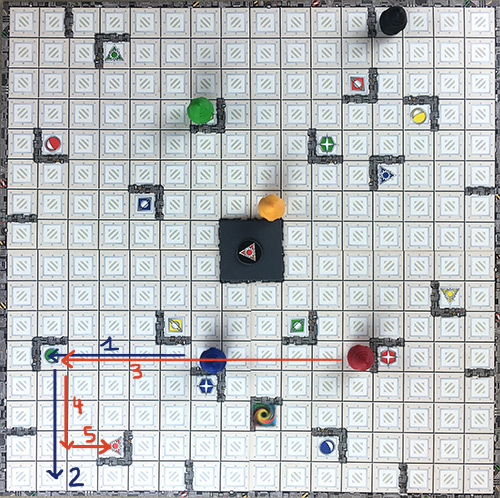
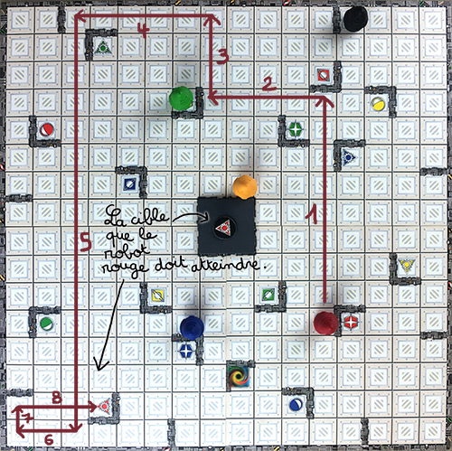

# SMP - TP10

# TP noté - Ricochet Robots

Le but de ce TP est d’implémenter le jeu ricochet robots en parcourant l’ensemble des concepts objets vus pendant le cours.

## 1. Règles du jeu

[https://fr.wikipedia.org/wiki/Ricochet_Robots](https://fr.wikipedia.org/wiki/Ricochet_Robots)
Ricochet robots est un jeu de plateau où 4 robots peuvent se déplacer sur un plateau 16 × 16. La partie est décomposée en tours de jeu, un tour consistant à déplacer les robots afin d’en amener un sur l’une des cases du plateau. Les robots se déplacent en ligne droite et avancent toujours jusqu’au premier mur, robot ou bort du plateau qu’ils rencontrent.
On peut aussi bien y jouer seul qu’à un grand nombre de participants. Le jeu est composé de :

- 4 robots de couleurs différentes (rouge, jeune, bleu et vert),
- 17 objectifs distribués en quatre groupes de quatre tuiles de couleur identique à celle d’un robot, et une tuile multicolore,
- un plateau 16 × 16 (voir les règles de génération du plateau ci-dessous),
- 1 sablier de 1 min.

À chaque tour, un des joueurs retourne une tuile objectif. Le but est alors d’amener le robot de la couleur de la tuile sur la case objectif dont le symbole est identique à celui de la tuile. Si c’est la tuile multicolore qui est tirée, l’objectif est alors d’amener n’importe quel robot sur la case multicolore du plateau.
Les joueurs jouent simultanément, chacun réfléchissant sur le moyen d’amener le robot en utilisant les règles de déplacement. Lorsque l’un d’entre eux pense avoir trouvé une solution, il annonce en combien de mouvements il compte réaliser l’objectif puis il retourne le sablier.

Les autres joueurs ont jusqu’à la fin du sablier pour proposer de meilleures solutions, utilisant moins de mouvements.

Après l’écoulement du sablier, le joueur qui a la solution comptant le moins de mouvement montre sa solution et remporte la tuile. S’il échoue dans sa démonstration, le joueur qui proposait le nombre de mouvements immédiatement supérieur montre sa solution, etc. jusqu’à ce qu’une solution soit valide.

## 2. Règle de déplacement

Sur le plateau, les robots se déplacent en ligne droite et le plus loin possible avant de rencontrer un obstacle. Durant leur tour, les joueurs peuvent utiliser les quatre robots comme ils le souhaitent (fig. 2.1).

Une fois mis en mouvement, le robot ne peut s’arrêter ou repartir dans une autre direction que lorsqu’il rencontre un obstacle. Les obstacles peuvent être :

- les bords du plateau
- les murs symbolisés sur le plateau
- un autre robot

Chaque déplacement de robot compte pour un mouvement, quel que soit le nombre de cases parcourues.

Remarque : Si, après avoir retourné une tuile objectif, il s’avère que la solution est atteignable en un seul mouvement, les joueurs devront ignorer cette solution et s’efforcer d’en trouver une autre.

FIGURE 2.1 – Exemple de mouvements pour rejoindre une des cibles rouges. [[source]](https://www.lemonde.fr/blog/unmondedejeux/2016/05/28/et-si-on-jouait-a-ricochet-robots/)

## Génération du plateau

Le plateau de jeu se compose normalement de 4 quart de plateau imprimé sur les 2 faces ce qui donne 96 façons différentes de poser les plateaux. Nous allons réaliser un générateur de grilles aléatoires pour nous donner plus de possibilités de grilles que le jeu original, mais en respectant certaines règles.

1. Placez les murs autour de la grille, ainsi que les murs qui forment le carré du milieu.
2. Pour la suite de la génération de la carte, nous allons travailler sur chaque quart séparément. Sur chaque quart, placez aléatoirement deux murs extérieurs, un côté vertical et un côté horizontal.
3. Ajoutez ensuite les murs intérieurs. Sur chaque quart, placez 4 "angles" constitués de deux murs chacun. Leur placement est aléatoire, cependant faites en sorte qu’un angle ne puisse ni en toucher un autre, ni toucher un mur extérieur.
4. Une fois avoir avons placé 2 murs extérieurs et 4 "angles" par quart, ajoutez un nouvel "angle" de deux murs placé dans un des quarts choisi aléatoirement. De cette manière, on obtient une carte contenant 17 "angles" et 8 murs extérieurs comme sur les grilles du jeu original.
5. Placez les 4 robots de manière aléatoire. Le choix de la cible (rouge, vert, bleu, jaune ou multicolore) est fait aléatoirement, son placement est également aléatoire mais forcément dans un angle de deux murs. Il y a au maximum dans une partie 17 cibles (4 de chaque couleur et 1 multicolore)

## Travail à faire

À l’issue du TP il est attendu :

- une description de votre conception du jeu sous forme d’un diagramme de cas d’utilisations et d’un diagramme de classes,
- une implémentation en C++ pour permettre à plusieurs joueurs de jouer à tour de rôle avec un affichage des grilles, cibles et robots sous forme texte, le code sera documenté
- l’illustration du bon fonctionnement des différentes fonctionnalités par des jeux d’essais.

Le code sera documenté, testé et versionné sous GitHub.